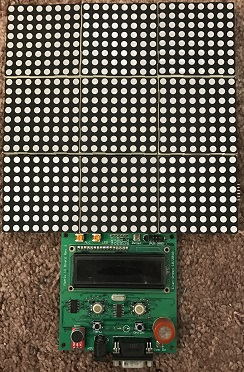
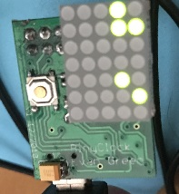
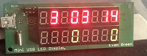
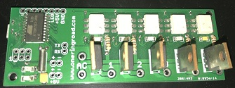
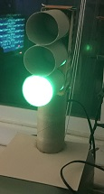
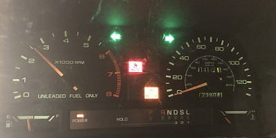
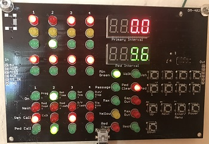
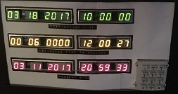
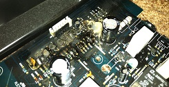
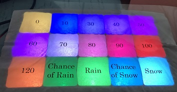

# Hardware Projects
This repository contains a collection of the personal hardware projects I've created over the years. These were created for my own amusement, usually because the idea intrigued me or because I wanted an excuse to try out a specific component or technique.

### Contents

[Matrix](matrix) - Interactive RGB LED matrix

[Binyclock](binyclock) - Tiny binary clock

[USB LED](usbled) - USB controlled 7-segment LED

[USB Relay](usbrelay) - USB controlled high voltage switch

[TP Light](tplight) - A simple traffic light made from toilet paper rolls

[PC Dash](pcdash) - Controlling a 1991 Mazda MPV dashboard via USB

[Airlight](airlight) - Wireless traffic controller system

[Marty McFly](marty) - Back to the Future style countdown clock

[Rokit](rokit) - Partial notes while trying to fix my subwoofer

[Icegrid](icegrid) - Wireless LED weather forecast with an ice cube tray

[Audidash](audidash) - Controlling a 1997 Audi A4 dashboard wirelessly

### Converging History
The history of this repository may appear a bit unusual, as there are several commits with no parent that seem to merge together at various points. Originally each of these projects had its own repository. Ultimately I decided to merge them together for a few reasons. First, I found myself wanting to reuse certain library pieces, which gets harder if the projects are in their own repositories. Second, no single repository really seemed to have enough history to warrant being on its own. Third, I was simply tired of all the overhead associated with managing several repositories, especially for personal use. So I merged them, taking care to maintain the history they already had.

### Building
Since these project span many years, there's no single consistent build system. Most of the projects are just simple Makefiles, so the build system can be intuited fairly easily. I build on Windows, though many of these Makefiles expect to run in an sh-like environment, usually [Swiss](https://github.com/minoca/swiss). The Windows apps compile with mingw. Many of the projects are for the AVR microcontroller, which means avr-gcc needs to be around. Finally, a couple of the later projects target an ARM Cortex M3. For that I just the Minoca ARM toolchain on Windows, since I had it sitting around.

### License
Libraries that I've pulled in here from third parties are available under the licenses described within those directories. All other files and modifications are licensed under the GNU General Public License, version 3. See the [LICENSE](LICENSE) file in this directory for complete information. If you'd like to use this code under and alternate license, contact me.
