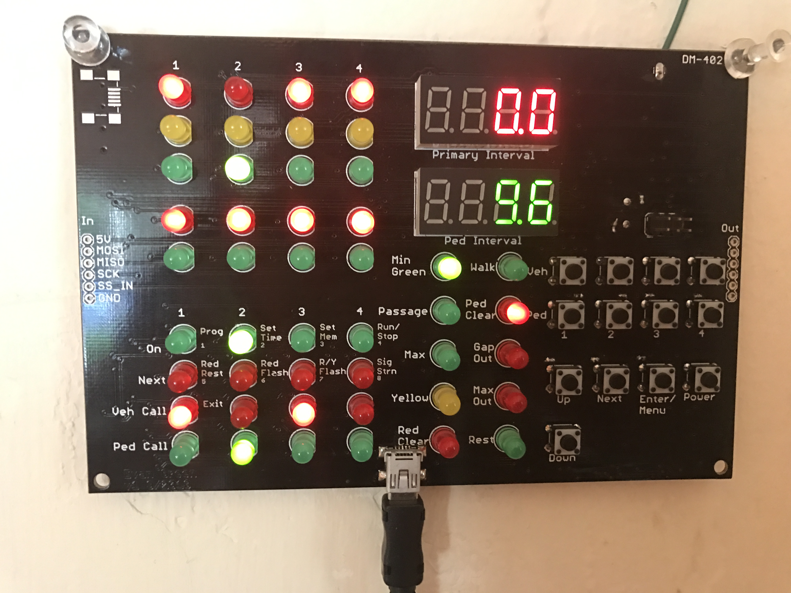
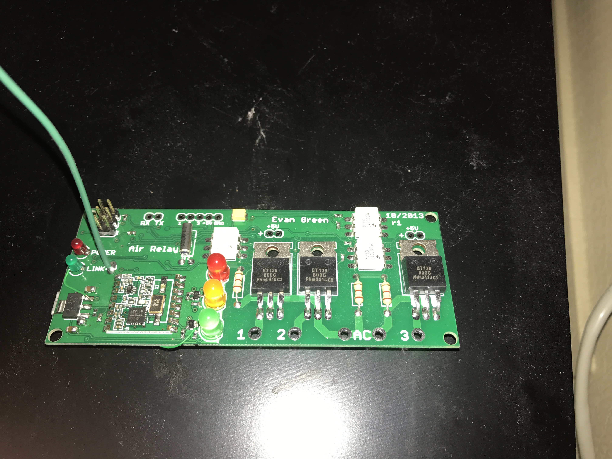
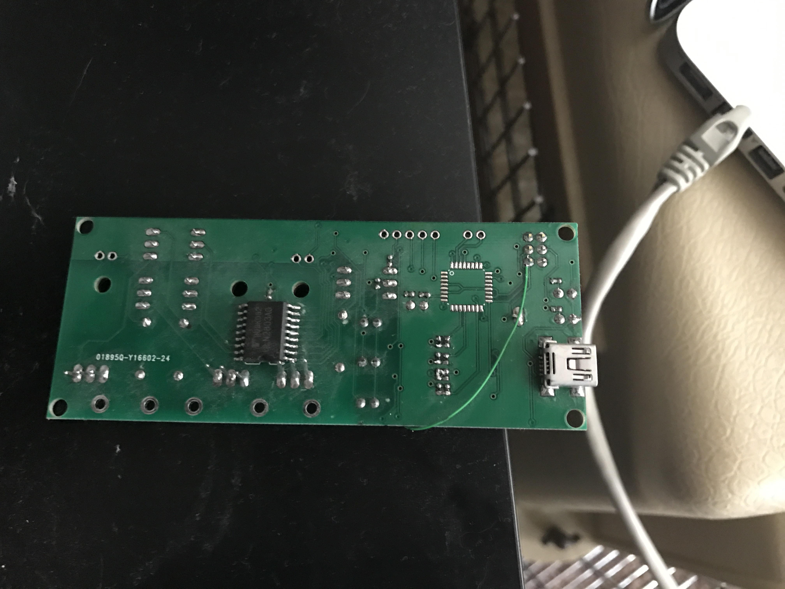
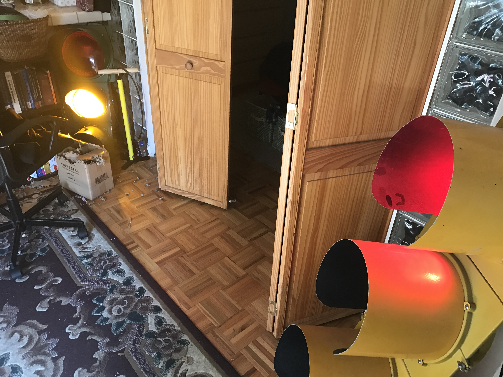
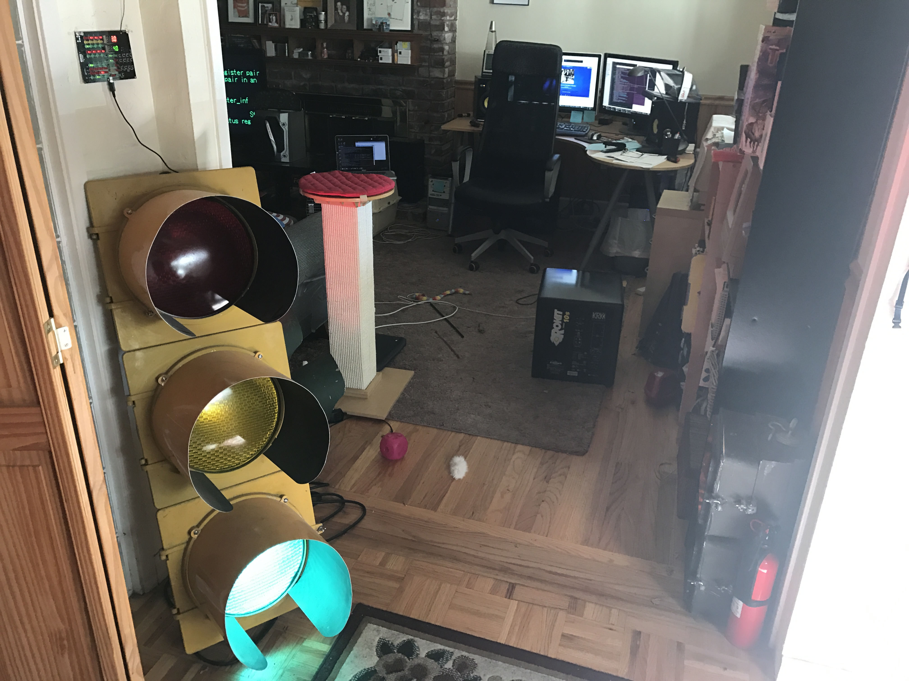

# Airlight

Airlight was a set of two hardware boards I started in 2013 in order to control the traffic lights I've collected in my house. It was also my first foray into the world of Wireless with the RFM22B boards.

### Design

The system consists of two components: a master board and several identical relay boards (one in each traffic light).

The master board is the brains behind the system. It contains the traffic controller logic, and sends out wireless commands to the relay boards in the traffic lights. The controller logic is an 8-phase semi-actuated traffic controller based on my previous work in college studying an old Crouse Hinds DM-800 controller. There are only enough LEDs to display 4 phases at once, but the controller logic can technically run 8 phases plus 4 overlap lights. This is equivalent to a 4 way intersection with protected lefts and protected rights in each direction. The traffic controller part also compiles for Windows so that I can test the traffic control sequencing without burning new firmware.

The relay boards are nearly stateless. They have a phase ID and pedestrian boolean burned uniquely into the firmware of each board so that each light knows which phase to respond to. They listen for wireless commands and respond appropriately. I also programmed in an RSSI response mode in case I needed to debug signal quality issues.

The relay board receives commands via the RFM22B wireless board into an ATMega168 MCU. It listens to incoming wireless messages corresponding to its phase and ped ID, and updates its 3 output pins (red, yellow, and green). The output pins are connected via optoisolators to triacs, which can flip 120VAC line voltage on or off.

### Results

Overall the project went very well. I was very pleased with the signal strength of the RFM22B boards. Reception was great anywhere in my admittedly tiny apartment, even though the relay boards were buried inside metal traffic lights. There are a couple of board errata, which were easy enough to fix and should be documented.

One aspect that I'm less than pleased about is the sharing of the SPI bus between the RFM22B and the LEDs on the master board. The RFM22B is very slow to respond, and hogs the bus for long delay periods, meaning every time a wireless command is sent there is visible flickering in the LEDs. If I had known the RFM22B was going to be a so slow I would have wired the LEDs separately, or maybe used something like an HT16K33 to drive the LEDs.

### Pictures
Some photos of the lights in my apartment

