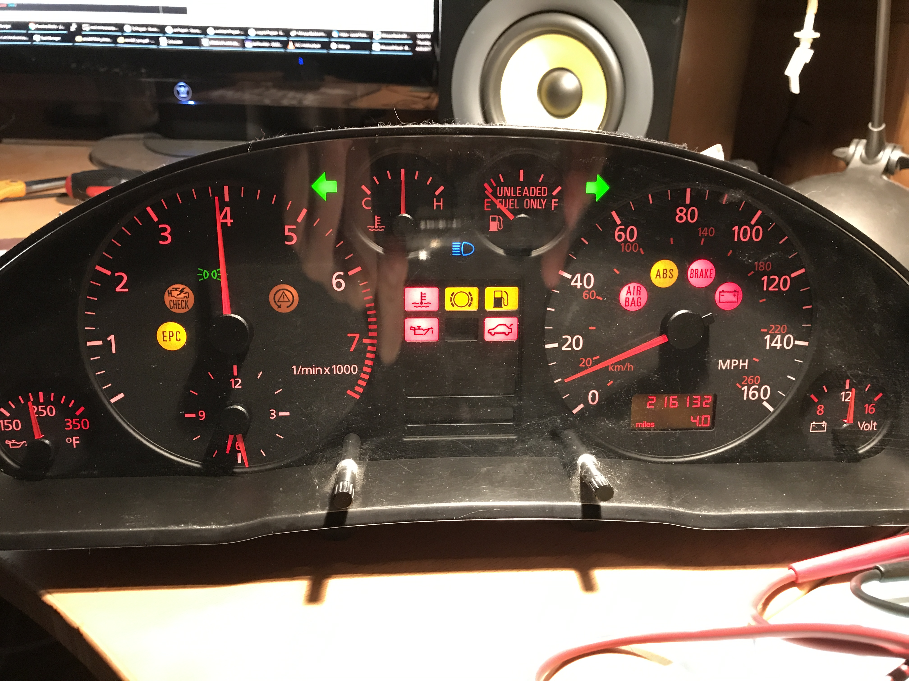
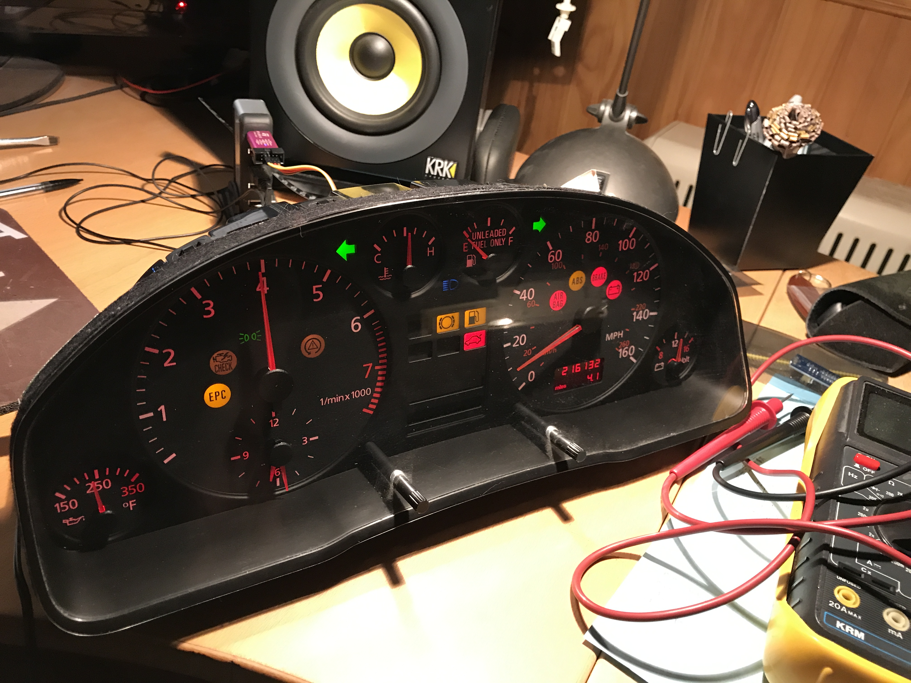
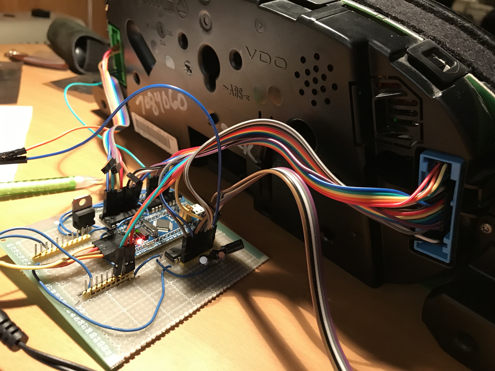

# Audidash

Audidash is a project I started in 2017 to connect the instrument cluster of a 1998 Audi A4 to my PC. The various indicators and gauges correspond to stats of my machine. For instance, the speed gauge correllates to my words per minute of typing, and the RPM gauge corresponds to my mousing rate. The left and right turn arrows blink when I use the left and right control or shift keys, and so on. It's actually the second PC instrument cluster I've created, though the interface turned out to be completely different from the first instrument cluster I wired up since this one has digital elements.

I got the instrument cluster on eBay for something like twenty or thirty bucks. This particular make/model has significance to me because it's the car I drove in high school (and still do at the time of this writing).

### Interface

The Audi instrument cluster I got interfaces with the rest of the car via two big 32-pin connectors on the back. The signals are mostly digital and want either ground or +12VDC. The speed and RPM gauges measure the duration between +12V pulses, as you might expect. A couple of the gauges (fuel, temp, and oil) are analog. I was able to approximate these signals using PWM and a spare capacitor to smooth things out.

### Board

The electronics I'm adding consist of an STM32F103 BluePill board (available on eBay for just a couple of bucks), and an ESP8266 Wifi board to connect to the local network. The STM32 MCU runs at 3.3V, but the instrument cluster needs +12V. I connected the I/O pins to a ULN2003A for active low pins, and other I/O pins to a TD62783 as a high side switch. I'm then using jumpers to connect the board to the instrument cluster.

Rather than send off to have boards made (since I only need 1), I decided to solder everything together manually on a protoboard. Many of the chips can line up side by side, so I can just make blobbly solder bridges rather than tediously adding jumpers around.

I left the default firmware on the ESP8266 board, and communicate with it via the AT command set the default firmware supports. The firmware I wrote on the STM32 is able to create a wifi network, which you can join to input your real WiFi credentials. The board will save the credentials, then connect to your home WiFi network. Once connected, it points to numbers along the RPM gauge to indicate the IP address it received.

Communication between the app and the device is done with simple text-based UDP packets. The connection has no state, the device simply maintains the last state that was sent to it.

### App
On the PC side, I cannibalized my last PcDash project as the starting point. The app runs on Windows (only), and installs low level keyboard and mouse hooks to measure mousing rates and WPM. It also monitors network traffic rates, hard disk I/O rates, and CPU usage to fire off indicators if some part of the PC is experiencing heavy use.

The app itself is a command line app that runs in the background. It takes the IP address of the AudiDash device on the command line, and sends UDP packets blindly to it to change its state.

### Quirks
It turns out the Audi instrument cluster is not a dumb device at all, and requires a fair amount of manipulation to display arbitrary data.

The gauges act in a non-linear manner, which is probably consistent with faking an analog signal using PWM and a capacitor. The temperature gauge is manipulated, so there are a large range of PWM values that correspond to the "straight in the middle" temperature reading. There are other weird aspects as well. For instance, the logic of the "oil pressure warning indicator" flips at a certain RPM, indicating I suppose that there should be oil pressure at higher RPMs, and not at lower RPMs. There is a range of RPMs between 1000 and 2000 at which neither polarity of the oil pressure sensor lights up the indicator. I'm surprised that all this logic lives in the instrument cluster itself, I would have expected it to live in a more central computer in the automobile.

I was also unable to manipulate the voltage gauge. It seems to directly measure the power supply voltage (shocker), so it just sits at 12V whenver the device is on.

I had to clip the speaker built in to the dashboard. I was a little bummed about this as the "door open chime" was kind of cool. Unfortunately whenever any warning indicator comes on (oil, fuel, and others) the speaker makes horrible screeching, which was unacceptable to me as I wanted to use those indicators frequently.

I briefly considered trying to open the thing up and tackle manipulating or routing around whatever microcontroller is inside the instrument cluster. This would give me complete unfettered access to all the gauges, indicators, and the speaker. I ultimately decided that would be too much work, it's easier to just manipulate the main inputs and live with a couple of restrictions rather than risk getting buried in microcontroller subversion or not being able to put the cluster back together.

### Results

This project went quite well, and now lives on my desk next to my monitor. According to it, I'm currently typing at about 40 MPH, which corresponds to nothing in particular.

The speed and RPM gauges are simple frequency counters, but in order to get good control of the analog gauges I had to do a series of empirical measurements. For each gauge, I directly manipulated the timer's PWM value and recorded the results. I then asked Excel to come up with a polynomial best fit, and used that in the app to get arbitrary gauge values. So far that seems to work great. I saved those in app/calibration.xslx.

The ESP8266 seems to work pretty well, though it has its quirks. The app sends out the left and right turn indicator commands twice a second to emulate a real turn signal. After a cold start, the ESP8266 seems to have trouble keeping up with that rate for the first few minutes. I also suspect the ESP8266 also sometimes interferes with other wireless devices on the network, but haven't done enough testing to confirm this.

I decided not to glue the jumpers between the instrument cluster and the board down, as the board is rarely jostled and friction seems to do a fine job. If they did get disconnected, it would be a pain to figure out where they go again, so I'll have to be careful when moving the thing.
