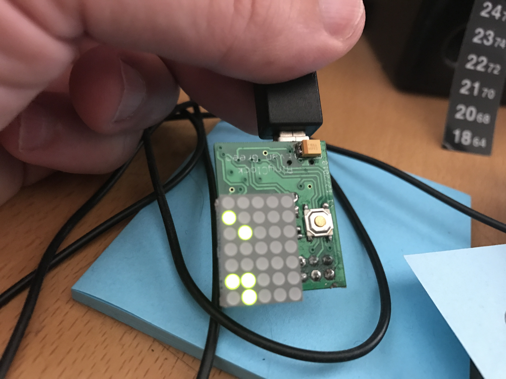
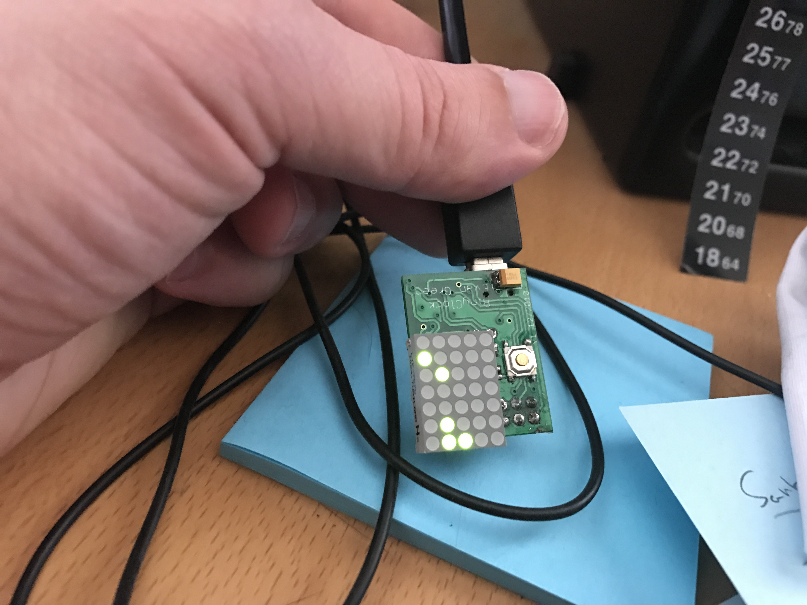
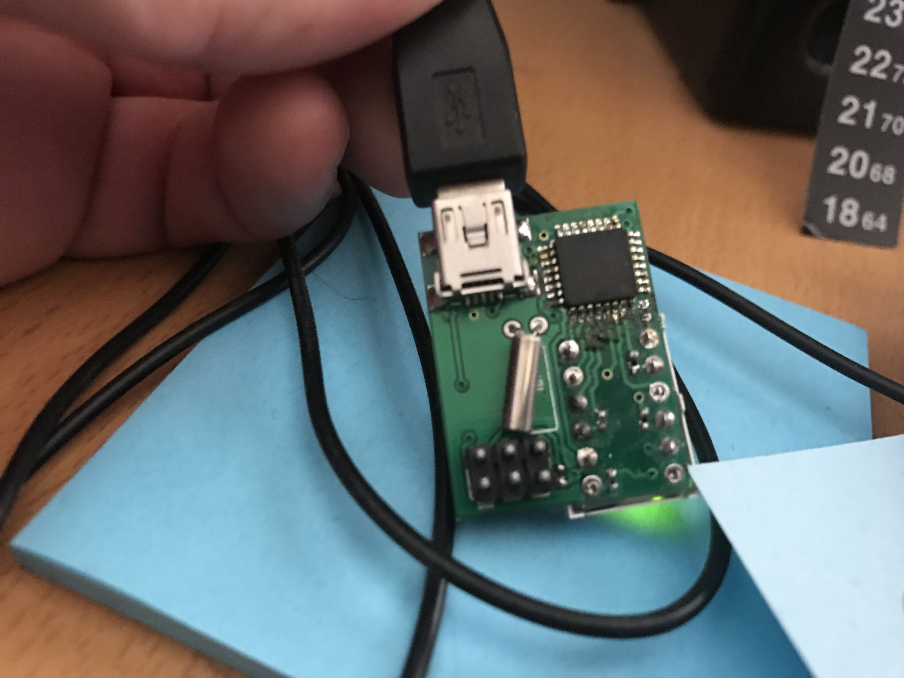
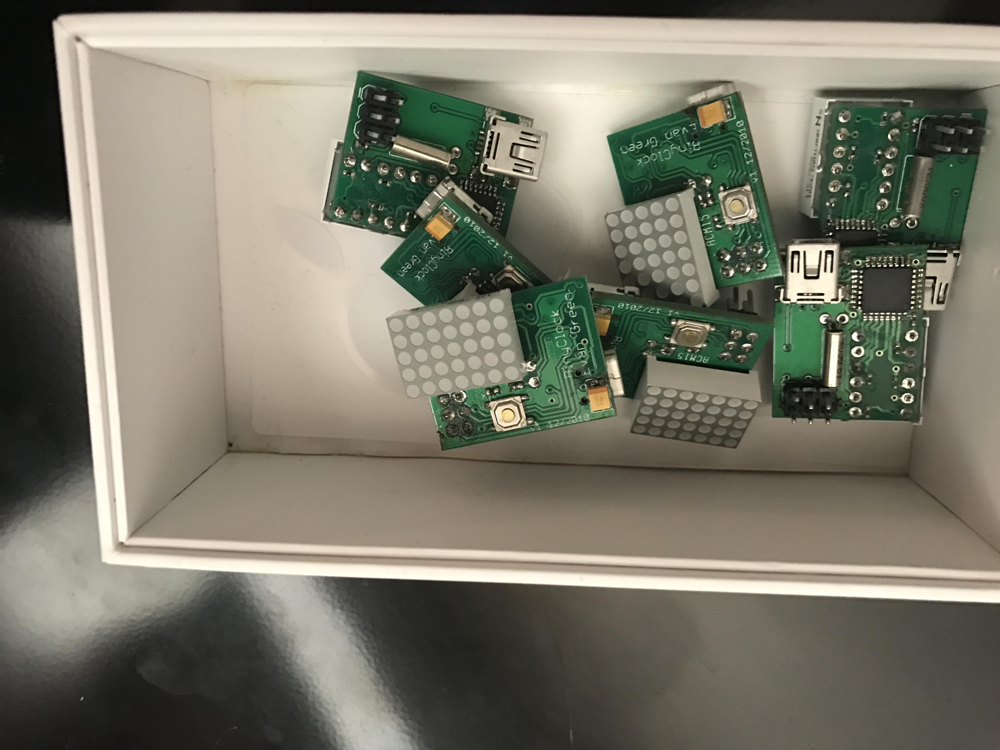

# Binyclock

Binyclock, short for tiny binary clock, was a miniature board I made in early 2011. It uses a 5x7 green dot matrix display and at ATMega8 microcontroller to display a binary clock. It also scrolls text occasionally and when the button is pressed indicating the full time and date. I made about ten of these, and gave them out as gifts to friends and family. I also programmed their names and birthdays into each, so it would wish them a happy birthday each year.

### Usage
The device contains a USB mini connector, so any USB mini cable can power it. The clock pretty much runs itself, and only has one button to keep size and cost down. Pressing the button momentarily scrolls the full date and time, which also happens on its own periodically. Holding down the button takes the user through a wizard-style interface, where the user is prompted with scrolling text to set the Year, Month, Day, Hour, and Minute. Short presses advance the value, and long presses move on to the next field, eventually completing the wizard.

### Results
This was my second electronics project outside of college, and I think it went well. The silkscreen ended up being a little too thin, I learned to use thicker text after taht. It also ended up being hard to mount anywhere, as the USB mini cable connector was nearly as big as the device itself. People also had problems with the device resetting when it was touched, which I'm not sure whether to attribute to a bad USB cable connection, or too low of a pullup on the reset pin. I bought really cheap USB-mini wall warts, so the power supply was also probably very unclean.

I knew the internal RC oscillator wasn't going to be stable enough to keep time, but I was dismayed to see that the 12MHz crystals I bought also drifted, sometimes by a lot. I tried to compensate for this by adding a calibration offset after measuring each unit over a period of 48 hours. I'm not sure if that really helped, and in one case I think I computed and set a bad calibration value.

Still, it was a fun project, it basically worked in the end, and I think people appreciated the personalized gift. I'll call it a success.

### Photos

Another shot of the front of the Binyclock

My remaining stash of BinyClocks
