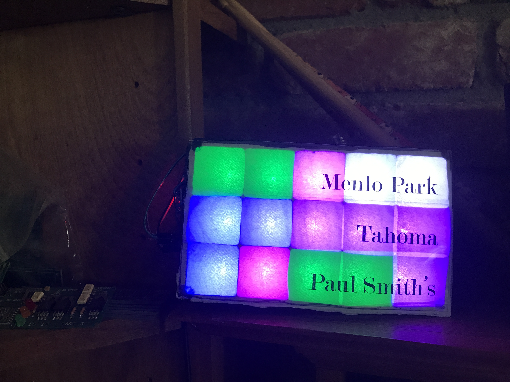
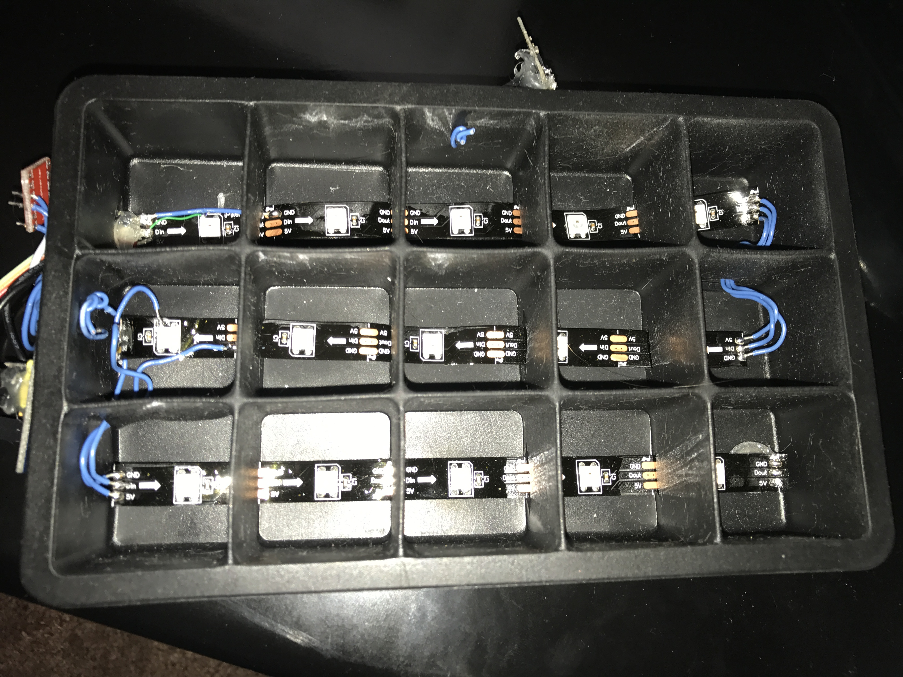
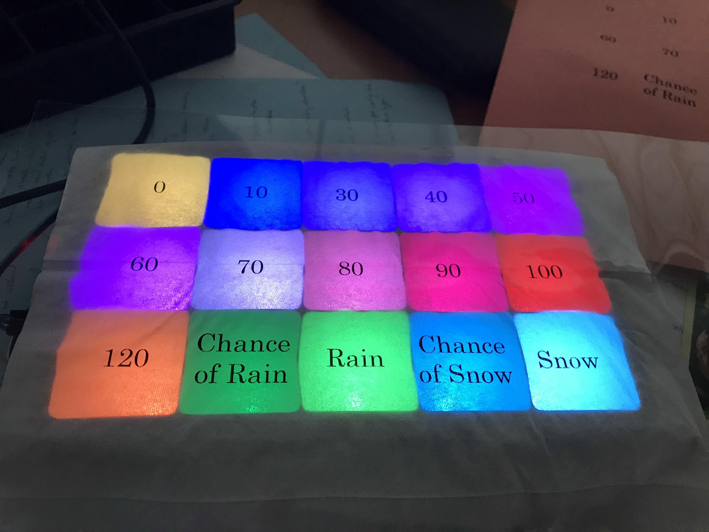
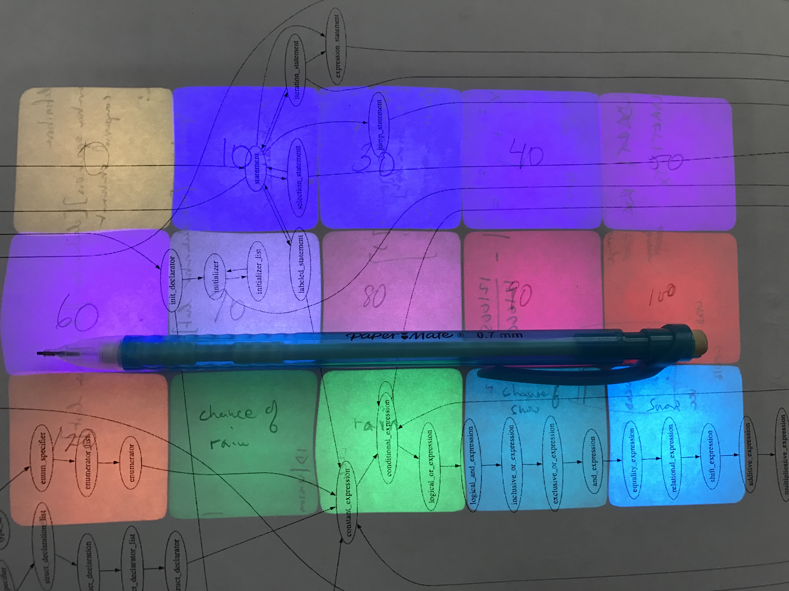

# Icegrid

The icegrid is a 5x3 wireless RGB LED indicator panel made from silicone ice cube trays, strips of WS2812 RGB LEDs, and an ESP8266 wifi board. I built two of these in 2016, and am currently using one to display a five-day weather forecast for three different cities.

# Design
I found some cheap silicone ice cube trays on Amazon, and combined them with cut up strips of WS2812 LEDs. I managed to find a combination of LED strip and ice cube tray that would result in one RGB LED landing in each ice cube slot. I cut the strips into groups of five LEDs, one strip per row. After cutting a slit in the bottom of the separators between columns, I was able to feed the strips through along the bottom inside of the tray, and solder wires to connect the three rows together into a backwards "S" pattern.

The WS2812 LEDs connect to an STM32F103 "BluePill" board, available on eBay for just a couple of bucks. The firmware converts an array of RGB values into a series of PWM widths needed to communicate with the WS2812. Using the DMA controller and a timer, that series of PWM values can be blasted out serially to the WS2812 strips. There is almost no CPU intervention, which frees up the CPU to talk with the ESP8266 Wifi controller.

I used the default firmware on the ESP8266, and had the STM32 communicate through it using the UART and AT command that comes burned in with the default ESP8266 firmware. The STM32 uses the ESP8266 to create a Wifi network on startup. The IP address is blinked out in binary on the display. A user can connect to the network and set their home network wireless credentials. The device will then connect to the home network, and save the credentials in (non-volatile) flash for future power-ons. Once connected, it will blink out the IP address it's received in binary and wait for commands.

The top surface is simply a single ply of a Kleenex for diffusion, and a transparency that I fed through my laser printer. Cut to size and add a dab of glue to each corner and you're good to go.

### App
The app is a simple Python script that takes in the IP address of the device, and sends text-based UDP packets to it to control the state of the LEDs. Every 30 minutes it gets the 5 day forecast from Weather Underground for three cities. It then converts the forecast into a set of colors, and sends it off to to the Icegrid device. If you adapt this project for your own use, remember to get your own Wunderground API key. For small numbers of API requests like what I'm doing, it's free.

The grid is organized so that each horizontal row is a city, and each column is a day. The leftmost column is today's forecast, the next left is tomorrow's, and so on.

The color coding I chose was meant to be easily remembered. It basically looks at the forecast high temperature for the day, and displays a shade of blue for cold, purple for cool to moderate, gray for anything in the 70s, and pink/red for 80s and above. It's easiest to just remember blue for cold and red for hot, and everything else falls intuitively in between. The hues have a granularity of 10 degrees Fahrenheit (eg. the high today is in the 50s), and display more intense shades for more extreme values.

This color scheme will be overridden if there is precipitation in the forecast for a day. Dirty green represents a chance of rain, bright green represents rain, dirty cyan represents a chance of snow, and cyan represents snow. It sounds like a lot to remember when written out like this, but I've found it to be fairly intuitive.

I chose to ignore other weather conditions like fog and haze. Things like sleet and ice pellets are simply converted to either rain or snow.

### Results
This was my first experience with the STM32 Cortex M3 MCUs. They're quite amazing, and are my new favorite given how much more powerful and cheaper they are than Atmel's ATMega microcontrollers. The STLink-V2 programmer and debugger is also super cheap, and comes with a nice portable app that can both program the device and do basic debugging. On the device itself, the DMA engine made it really easy to blast out data to the WS2812 without bogging down the CPU. My design choice here did have some laziness-memory tradeoffs, though.

Memory space would become a problem if I needed to control a large number of WS2812 LEDs, since I'm converting each 4-byte LED RGB value into 24 16-bit PWM values. That's 52 bytes per LED, which works great for 15 LEDs, but wouldn't work well for hundreds. If I needed to accomodate more LEDs, I could come up with a "sliding window" algorithm that converts only the portion of the RGB values that are coming up next for DMA transmission into PWM values. This would add a little load on the CPU, but drastically reduce memory usage. Fortunately for 15 measly LEDs, there's no need to bother with any of that.

The LEDs are quite bright, and I ended up needing to program "dark hours", even though the device lives in our living room on the mantle.

Occasionally the Python script seems to quit on me. The shortcut on my desktop means the window closes before I can see what the exception is, and I'm too lazy to manually fire up a prompt to see it, since it's on my media PC that has a tiny handheld keyboard. It's probably a temporary network exception, which could be fixed with the right try block around the network part.

I really enjoy this device, and it's quite useful to me as I can quickly glance at it in the morning to get a sense of the weather for the week.

### Photos

The insides of the IceGrid

Legend for the forecast colors. High temperatures round to nearest 10 degrees (eg. 70 ~ 65-74).

Prototype legend before printing the transparency
