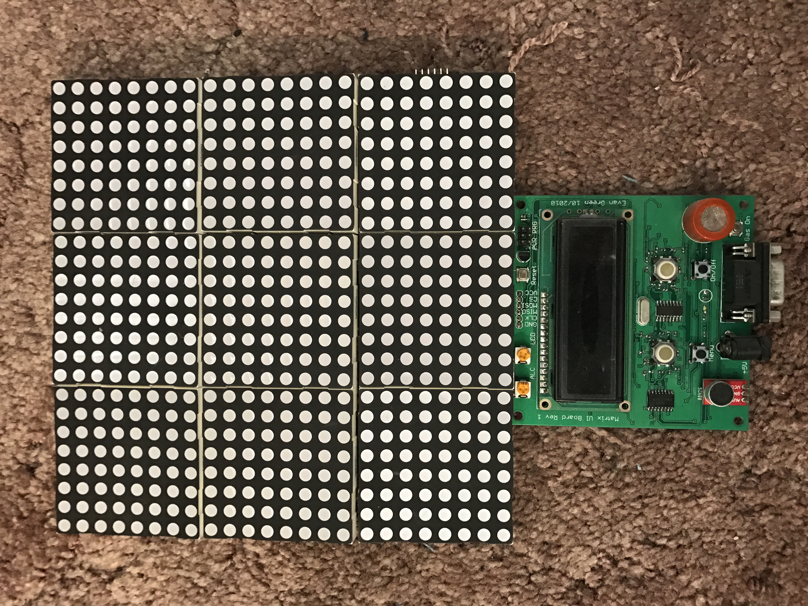
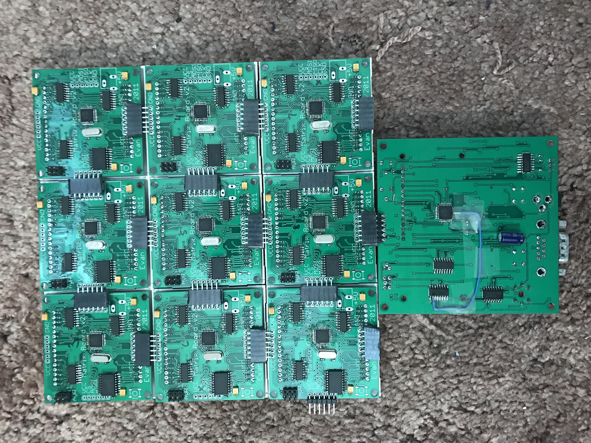

# Matrix

Matrix was an RGB LED matrix art project I started in 2010. It was my first hardware project outside of college. The idea was to hang it on a wall, and have it be an interactive display that people could play with. I envisioned it having simulations like Boids and Conway's Game of Life, as well as games like Tetris and Sokoban. For kicks it also contained a blood alcohol sensor that could allow participants to test their level of inebriation, and a microphone to use as an interactive source of randomness. The primary interface was two blackberry trackballs and several buttons. Overall most of it worked, but it contained a few fatal design and implementation flaws, and ultimately I ended up abandoning it before completing the project.

### Design
The hardware design consisted of two boards: a single mainboard and several slave boards. The mainboard contained a 16x2 character LCD display, the BAC sensor, a microphone, two buttons, two trackballs, an RS-232 connector, and a barrel connector for power supply input. It also had the ATMega328, which was the brains of the whole device, and a set of SPI pins that plugged into the slave boards. The slave boards were connected to each of 9 8x8 RGB LED matrices. The slave boards acted as a "backpack" for each RGB matrix. The same set of SPI pins were piped out on all four edges of the board, meaning you could plug them in to form an arbitrary sized display. Each slave board had an ATMega on it that was responsible for multiplexing out the current state for its 8x8 RGB matrix. Colors were achieved by lighting LEDs for only some time slots, and leaving it off for others.

The trackball had hall effect sensors underneath it, which I basically copied from SparkFun's breakout board. There were RGB LEDs underneath each trackball to light them up for application-specific purposes.

### Firmware
The slave board firmware had a unique ID programmed into each board. Also hardcoded into it was the overall size of the board. The entire board's pixel data was sent out over SPI by the master board, and each slave board listened for and updated the portion that corresponded to the region it controls. The slave board spent most of its time repeatedly multiplexing its contents out to the LEDs themselves.

The master board contained all of the logic and applets that could control the display and manage input. It started with a main menu that used the 16x2 character LCD. It allowed the user to choose an applet. The applet, such as Tetris, would then take over until the user pressed the Menu button to get back to the main menu.

I successfully added applets for Tetris, Sokoban, a binary clock, and the Game of Life. I started adding a Boids simulation, and the project basically stalled out when I ran into issues there.

### Issues
The project had several issues. To start with, it was overly ambitious and expensive, especially for a first-time project. In 2010, RGB LED matrices were quite expensive, and I spent well over $100 on the LEDs alone. Boards were also expensive back then, and I had to make two different boards, one of which required a quantity of nearly 10.

There were also layout issues. The mainboard had some errata, which I'm disapointed to say I never wrote down. What was most disappointing was the fact that I didn't quite set the slave board headers far enough into the board. So the nine 8x8 segments connected, but there was either an awkward gap between the segments, or when squeezed together the boards pitched forward into a concave shape.

Additionally, the ATMega328 I chose (basically because of Arduino and the wealth of documentation) was woefully underpowered to do the things I wanted to do. On the slave board side, the software PWM/multiplexing to get darker colors kind of worked, but there would end up being noticeable flicker at low intensities.

More importantly, a 16MHz MCU has bandwidth problems when trying to pump out a 24x24x24 bit set of pixel data at a reasonable framerate. The ATMega has very little RAM, and weak offloading capabilities, so that leaves very little time for the CPU to do anything other than pipe out pixel data. I considered compression when sending out over the wire, but that's unsatisfying since there will always be those cases where something like run-length coding doesn't get you any gains in bandwidth, and costs additional precious CPU time to compute.

Even ignoring the display bandwidth problems, the ATMega328 is underpowered in terms of CPU speed and memory for the applets I wanted to create. Conway's Game of Life worked, but was tricky and slow since I didn't have enough memory to store two copies of the board. Tetris worked well. Sokoban worked, but used a lot of flash space to store the boards. Boids seemed like it was going to be impossible on a tiny 8-bit 16MHz MCU, and it was at this point that I got discouraged and gave up.

I played with the BAC sensor a little, but came to the realization that it's not nearly as simple as reading a sensor value. The sensor itself contains a heater, so the measurements seemed to come out very differently each time, depending on timing and duration. I would have had to do a bunch of manual calibration, which might have been fun, but never happened.

### Conclusion
Unfortunately this ambitious project never really came to fruition. The RGB LED matrix backpacks are pretty cool, so I still have the project. I may consider taking the individual backpacks and trying to incorporate them into another project some day.

For Christmas in 2016 I got a 32x32 single unit RGB LED matrix, which I believe cost less than forty dollars. Maybe some day I'll revive some of the software in this project in an attempt to find a use for that board.
