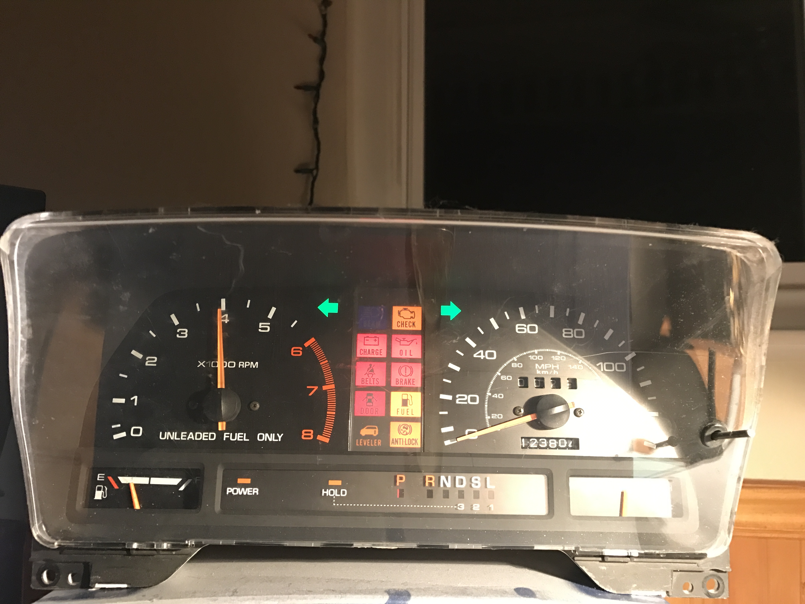
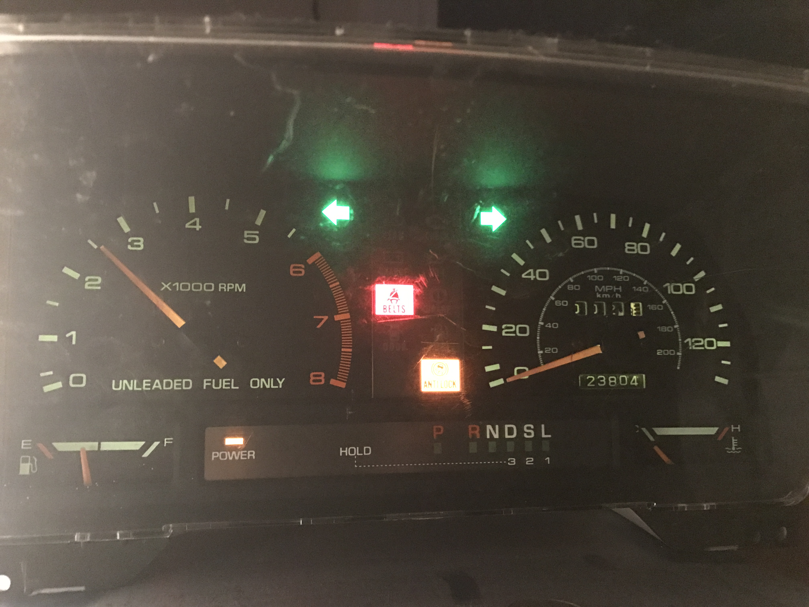

# PC Instrument Cluster

This project from early 2013 connects the gauges and indicators of a 1991 Mazda MPV instrument cluster to a PC. An app on the PC can be used to control the indicators and gauges via a USB serial connection to the device. I currently have it measuring stats about the PC and my interaction with it. For example, the RPM gauge correlates to my words per minute typing. The temperature gauge corresponds to the current CPU usage. The fuel gauge starts out full and becomes empty as I use the machine for 2 hours without taking a break (indicator lights also start coming on to tell me to take a break). The left and right turn signals blink whenever I use the left and right shift keys. Various indicators correspond to miscellaneous stats, like increased network usage or using the backspace key.

### Design
The control board itself is a simple protoboard with an ATMega32U4 breakout board from SparkFun. A USB cable powers the logic of the board and provides the communication interface to the PC. A molex connector provides a 12V supply, which is needed to light up the indicators and gauges.

Some indicators seem to want ground to activate, others want +12V. I use a ULN2003A for active low indicators, and a TD62783 for active high indicators. The protoboard I used was unusually small, so fitting all the components on the board required some creative positioning.

The most tedious part of the whole thing was soldering leads to the flexible plastic PCB on the back of the instrument cluster. The actual connector would have been a large thick plastic rectangle that made contact with the flexible plastic PCB via friction. I had no such connector, so I ended up using a soldering iron to solder wires to the board wherever I could find a purchase. The copper is exposed, which makes it easier to solder to in some ways, but also harder since the copper is somewhat oxidized. If the soldering iron slips off the copper contact, it instantly melts the surrounding plastic. There were over 20 contacts, so progress was slow, tedious, smelly, and prone to breaks in the traces or plastic.

### Firmware
The firmware is pretty simple. I used Dean Camera's LUFA library to enumerate a USB serial port, meaning I didn't have to write any drivers on the OS side. The app writes a binary structure to the serial port, and that sets the GPIO ports and the durations for a couple of timers in the microcontroller. The timers are used in PWM mode for the RPM gauge, which simply counts 12V pulses, and the fuel and temperature gauge, which needs an analog voltage.

The fuel gauge is sluggish to respond, so PWM works well. The temperature gauge is very quick to respond, so a fast period is needed to keep the needle from dancing back and forth. The fast PWM period causes a slight whine from the temperature gauge. This could probably be ironed out with a capacitor to smooth out the transitions.

### App
The app is a simple Windows app. The serial port can be specified on the command line, or if none is specified the largest COM number will be used. It installs a low level keyboard hook to measure words per minute, and uses various other Windows API functions for its other statistics.

### Results
The end result is great fun. The glow and decay of real incandescent bulbs in the indicators is very satisfying. I have this instrument cluster sitting on my desk, recording a typing speed in the 6500 RPM range (past the red line!)

Unfortunately becase the speed gauge is mechanical, I was never able to gain control of it. I bought a speedometer cable and a stepper motor. Unfortunately the stepper motor couldn't spin fast enough to achieve the revolutions per minute needed to span the dial, and it made a horrible racket while it was on.

Also, I've got an old halogen Ikea lamp on my desk that causes problems. Sometimes when I turn it off I can hear a pop in my speakers, and occasionally that causes the firmware in the ATMega to stop responding. Maybe it's resetting, and then not going through USB re-enumeration? The workaround is just to unplug and replug the USB cable. Kind of a pain, but just uncommon enough to be too much of a hassle to debug.

Overall this was a great project, and I love the end result. It has a few quirks that I was unable to work around, but they don't seem to prevent me from loving it.

I've actually got another older instrument cluster that I bought around the same time. This one had a dual layer flexible plastic PCB (rather than the single layer in this instrument cluster). I got as far as soldering wires to the bottom layer, and then lost interest. Maybe some day I will resurrect that instrument cluster, and will update this project (or just copy and adapt it).
