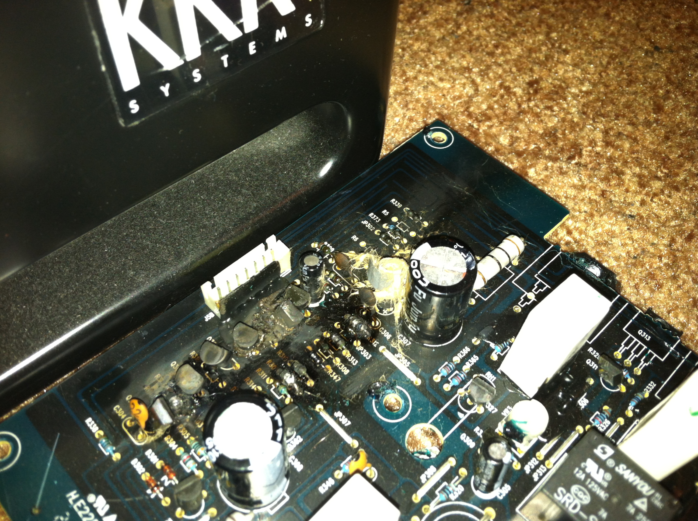
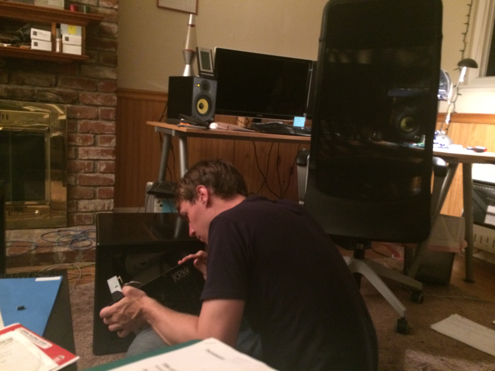

# KRK Rokit RP10S Amplifier Board

This isn't really a project in its own right, nor is it a complete schematic. These are really just my own notes while trying to debug a catastrophic meltdown in my KRK RP10S powered subwoofer in 2016.

I wasn't around when the unit failed, but from the damage it looks like it was quite sensational. It caused enormous damage within the board, blew one capacitor up completely (I found the cap to it rattling around in the enclosure), and melted one half of my outlet. For how much current must have flown through the outlet to melt it, I'm shocked that neither the fuse nor the circuit breaker tripped.

I made an attempt to reach out to KRK via Facebook, since this failure mode seems potentially unsafe to consumers, but they have been acquired by Gibson and as far as I can tell there's no way to get in contact with a human there. I don't live in an area with lightning strikes, and no other electronics were affected, so it seems unlikely there was an external factor here.

Anyway, I decided to try and take a stab at fixing the board, since this subwoofer was expensive and I'd only had it for a few years. There's an LED on the front of the suboofer that is normally green, but was now showing red.

I brought Ron Crane over to take a look at it. He poked at it for awhile, and we eventually concluded that we wouldn't be able to figure this out without mapping out the board. Fortunately, the board is dual sided, but the traces are identical on both sides, making it single sided with extra-good visibility.

This schematic was my attempt at figuring out why that LED was red, and make it go green. It turns out the LED is kind of a logical OR of many different status signals. Even after replacing parts, in my case I had a pair of transistors whose bias was just outside the tolerable range. This was probably because I had replaced a bunch of parts, but not quite enough, so I ended up damaging the replacement components slightly.

Once I replaced that pair of transistors, the LED went green, and the device almost worked. If I turned the volume up enough and the frequency response high enough, it would make occasional grunts with the music. The sound was awful, kind of like the sound of stompy neighbors walking around upstairs.

I don't own an oscilloscope, so debugging sound quality issues is a little above me. So I gave up and bought a Monoprice powered subwoofer as a replacement. I still have my KRK RP5s though, and those are working wonderfully... so far.

### Photos

The yellow stringy area is the completely exploded electrolytic capacitor. It got all over large parts of the board. I'd never seen that before.

A photo of me pulling the back panel out of the woofer cabinet.
