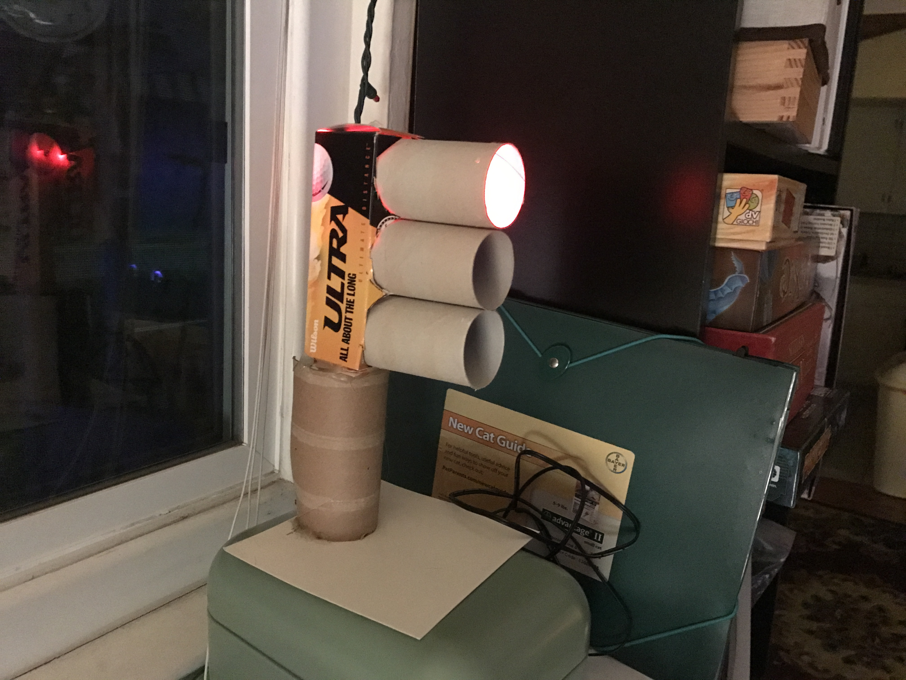

# Toilet Paper Traffic Light

This was a really goofy craft project idea I had back in 2012 to make a traffic light out of toilet paper rolls, ping pong balls, LEDs, and a golf ball box.

I cut the ping pong balls in half, coated one hemisphere with tinfoil for reflectiveness, poked an LED through one "pole", and put a single ply of Kleenex through the equator. I then sealed the two halves of the ping pong balls back together, and attached them to the ends of toilet paper rolls. The three toilet paper rolls sit together nearly perfectly inside a single golf ball box I got from my grandfather. Another toilet paper roll, a leftover sturdy invite card, and some glue gun action finished the job.

To control the traffic light I got a through-hole ATMega168, clipped a USB power supply, and soldered everything together directly on the pins. No protoboard needed.

This project contains the ridiculously simple firmware for the traffic light. It still sits in my living room. Of all the gadgets I have floating around the house, this is usually the favorite of any new guest that comes in. I always sigh a little, because it's the least technical project here.

### Photos

