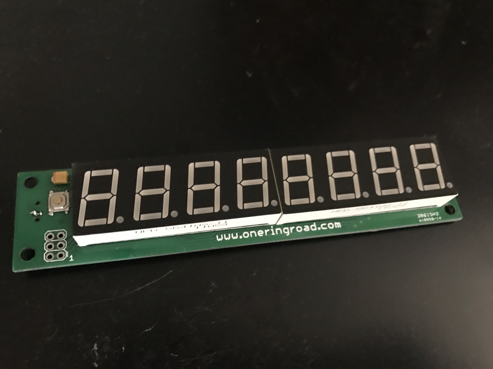
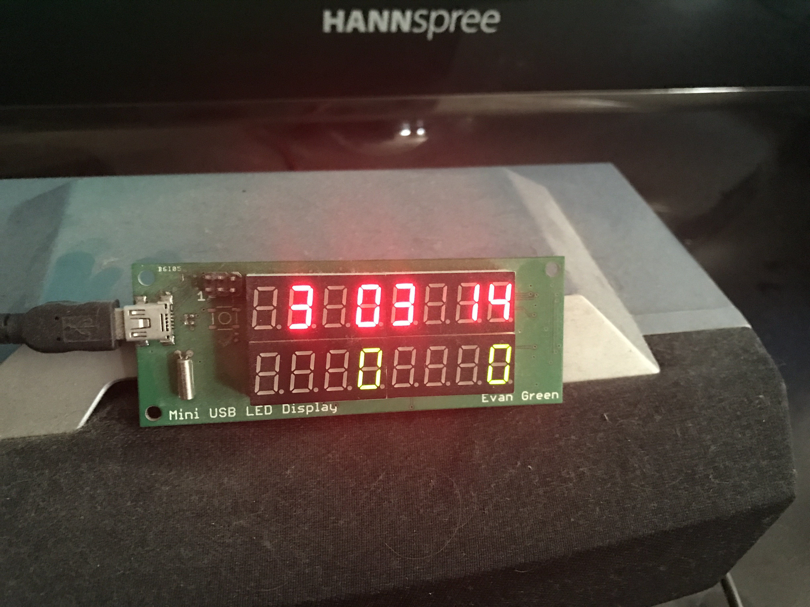
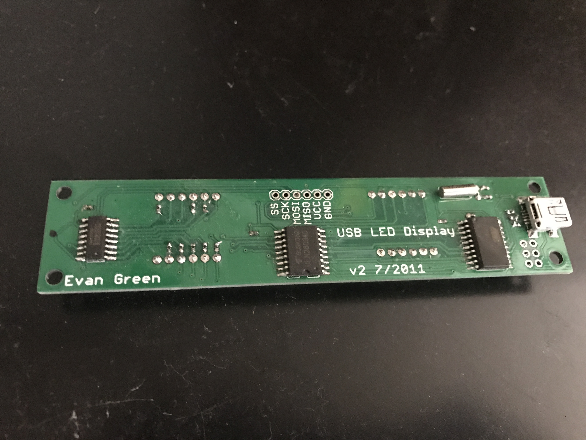
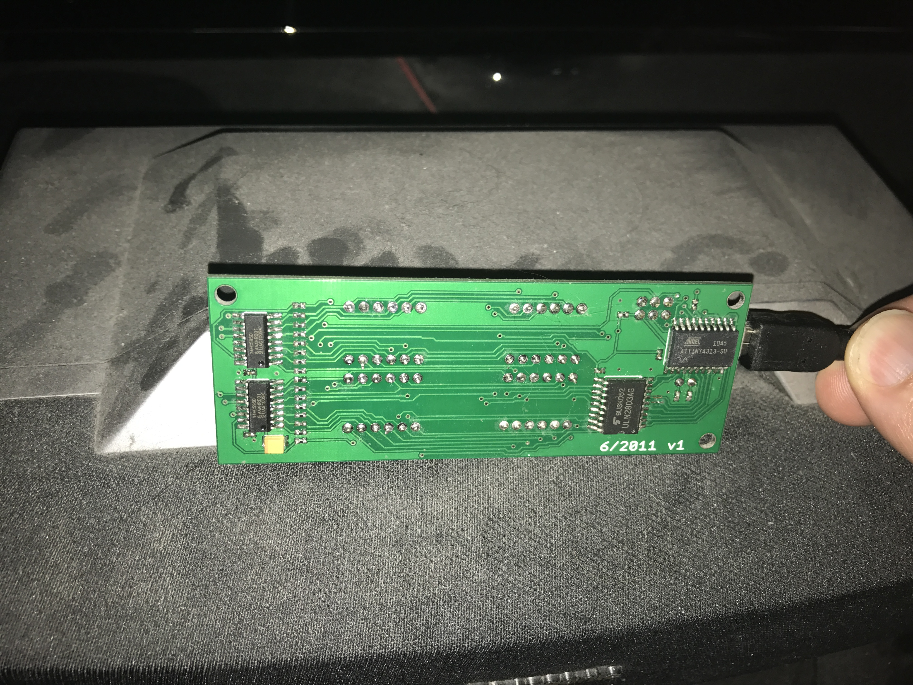

# USB LED

The USB LED was a set of two boards I created in the summer of 2011 in order to wire up a 7-segment LED to my PC via USB. The board came in two variants: a 0.56" 8-digit single row version, and a smaller 0.36" 8x2 dual row version. I assembled the 0.56" version with a few different LED colors. The smaller USB LED Mini always had a row of red LEDs on the top and green LEDs on the bottom.

### Design
The hardware design included an ATTiny2313 connected to a ULN2003A and two chained 74LS595 shift registers, which were connected to the LED in matrix form (digits and segments). The ATTiny would communicate with the PC via low speed USB. The ATTiny doesn't have USB support, so I used Dick Streefland's USBTiny code, which amazingly bitbangs out USB in software. The rest of the firmware enumerates a USB device and responds to a simple control transfer to set the LEDs.

The Windows app utilizes libUSB as the device driver, and sends control transfers to set the LED state.

### Uses
For awhile I used these boards as stats for our website at work. I still currently one of the mini boards as a clock and network meter on my media PC. At one point I also had a small website where I sold a few of these.

### Results
This was a successful project. I did two revisions of the USB mini board, I cannot remember the flaw in the first revision. The LEDs themselves were cheap and came from Futurlec. The 0.36" LEDs were great, but I didn't love the 0.56" LEDs.

### Photos

Back side of the USB LED.

Back side of the USB LED Mini.
