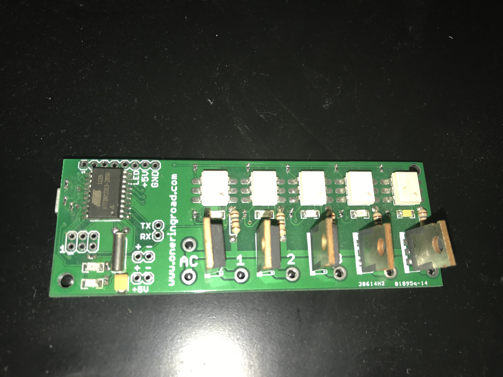
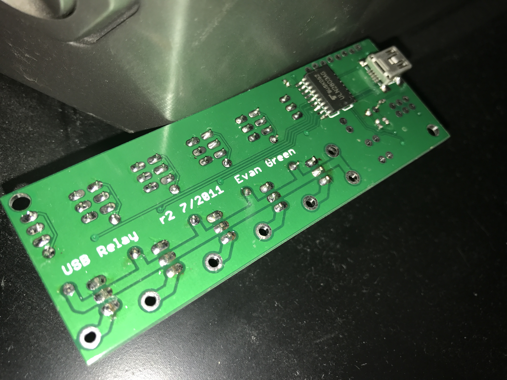

# USB Relay

This was a project I did in the fall of 2011 as a follow-on to the USB LED project from the summer. It utilized the same processor, communication interface, and ULN2803 as the USB LED, except instead of controlling LEDs it controlled triacs capable of switching 120VAC.

# Design
Heavier traces at the bottom of the board carried AC load separate from the low voltage logic. A common AC input was sent to 8 triacs in the first revision of the board, which was reduced to 5 in the second revision. Outputs from each of the triacs could then be connected to AC devices. The control pins of the triacs are connected to optoisolators, which then connect to the ATTiny2313 microcontroller. The optoisolators help keep the high voltage away from the low voltage. Surface mount LEDs of different colors for each triac indicate whether the triac is conducting or not.

To create this project, I simply modified the firmware and the app from the USB LED code I had already created. The app could set the state of each of the triacs independently.

### Uses
I put one of these boards in a traffic light, and then created a small website where people could post on the website to change the traffic light along with their name and a short message. This lived in a window along University Ave in Palo Alto for about a year. The website was actually a reincarnation of a similar thing I did with a traffic light on my balcony back in Seattle.

I never opted to sell these boards because I was worried about people being unsafe with the high voltage. I built about 10 of them, so I still have a bunch of these boards. I bought several outlet boxes and sockets to install these boards into. I put one together, but got a little nervous about heat inside the boxes due to potentially high current through the triacs. I was hoping to be able to use this as a remote power switch for my computers, but never quite got that all set up.

### Results
The project was successful, as the board worked, although I never found a serious home for most of these boards. To minimize PCB size I only provided enough room in the layout for the traics to stand upright, which in retrospect was a mistake, since they're big, conductive, and the leads are fairly bendy.

This board is my first experimentation with triacs, which I prefer to mechanical relays due to their small size, solid stateness, and lower cost. I was pleased that everything worked well, and would end up reusing parts of this design in the Airlight control boards much later.
